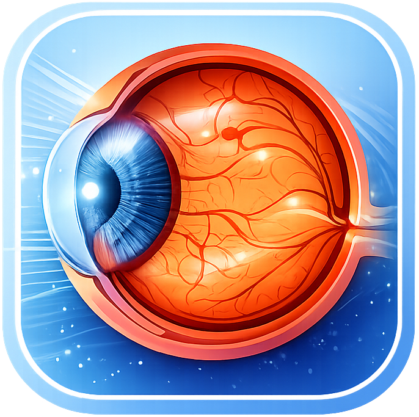

  

<h1 align="center">
  
    RetinopatiaApp
  
</h1>

  
    
    
    
    

  

---  

## Introduction

RetinopatiaApp is a desktop educational application designed for training and
self-assessment of skills in recognizing diabetic retinopathy
from retinal fundus images.

The project combines interactive image annotation, user attention analysis,
and neural network–based evaluation to help users better understand
visual patterns associated with different stages of the disease.

---

## Features

### AI Analysis
- [x] Automatic classification of diabetic retinopathy stages
- [x] Grad-CAM attention visualization
- [x] Comparison between user attention and model attention
- [x] Dice coefficient calculation
- [x] Final performance score

### Interactive Training
- [x] Manual attention area annotation
- [x] Brush and eraser tools with adjustable size
- [x] Step-by-step training workflow
- [x] Randomized image sampling

### Statistics & Progress
- [x] Training history
- [x] Knowledge quality score (QWS)
- [x] Attention similarity metric (AIS)
- [x] Progress tracking over time
- [x] Last activity monitoring

### Account Management
- [x] User registration and authentication
- [x] Password change
- [x] Logout
- [x] Account deletion with confirmation
- [x] Server maintenance mode handling

### User Interface
- [x] Modern PyQt5-based GUI
- [x] Custom rounded dialogs
- [x] Frameless draggable windows
- [x] Unified visual style
- [x] Fully asynchronous server requests

---

## Technical Stack

### Core Technologies
- [x] Python 3.11+
- [x] PyQt5
- [x] PyTorch
- [x] ONNX Runtime
- [x] NumPy

---

## Roadmap

- [ ] Offline mode without server dependency
- [ ] Extended statistics and analytics
- [ ] Export of training results
- [ ] Additional datasets support
- [ ] Improved attention visualization
- [ ] GPU-accelerated inference
- [ ] UX and performance improvements

---

## Project Status

The project is under active development. \
Core functionality is implemented, while UI, performance, and training scenarios continue to evolve.

---

## License

This project is licensed under the **MIT License**.

---

## Support

If you find this project useful, consider supporting it by: starring the repository, reporting issues, suggesting improvements, contributing to development.

  © 2026 · Created by redictor

